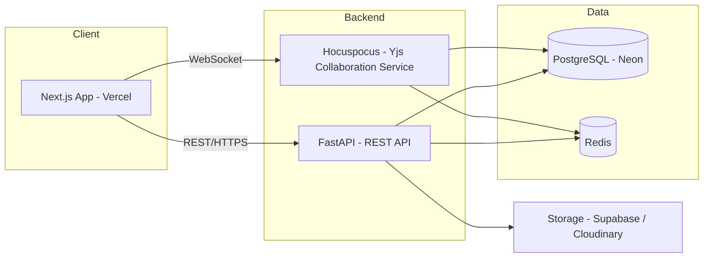
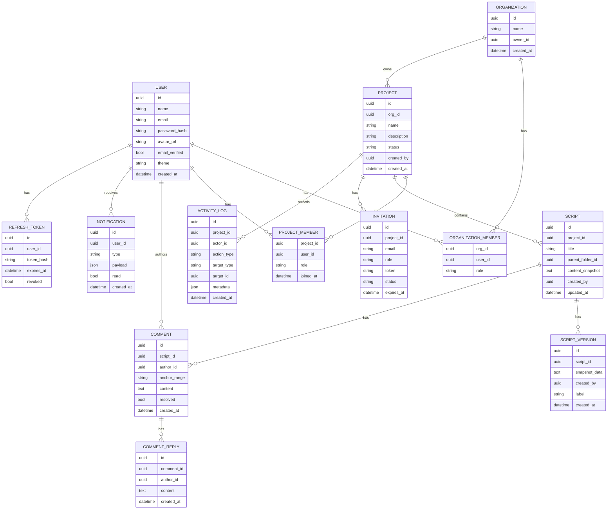
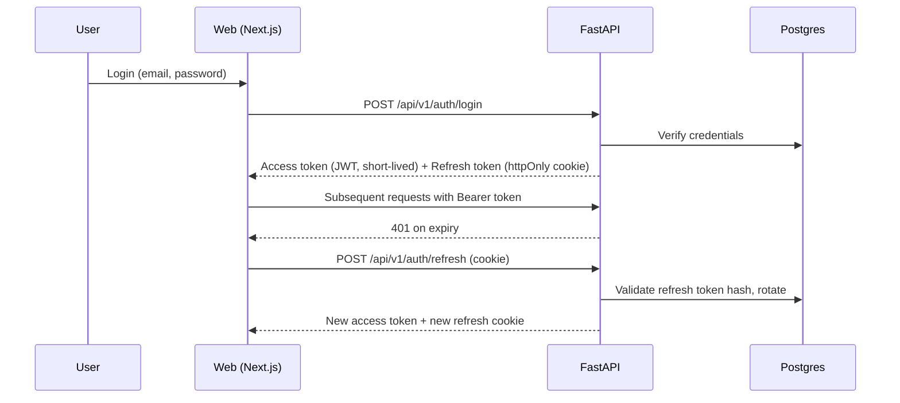
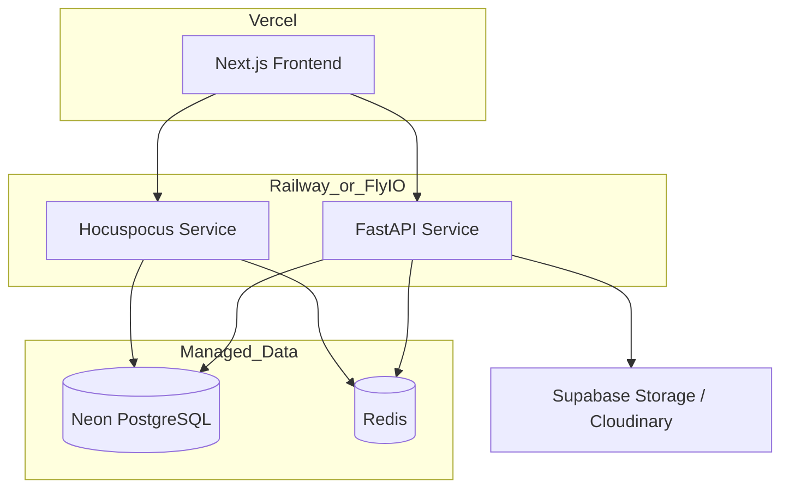

# Scriptora — Initial Architecture

**Version:** 1.0 (Draft) · **Date:** July 2026

This document defines the initial technical architecture: system layout, folder structure, database schema, API conventions, real-time collaboration design, auth flow, and deployment topology. It is the engineering companion to the PRD and SRS.

---

## 1. High-Level System Architecture



Two backend services, one shared database. FastAPI owns business logic (auth, projects, roles, comments, search, notifications, export). Hocuspocus owns real-time document sync only. They share PostgreSQL as the source of truth and Redis for cross-instance pub/sub and caching.

---

## 2. Monorepo Structure

A single repository keeps the client-project surface manageable for a solo developer while still separating concerns cleanly. This section shows the top-level layout; for the complete file-by-file scaffold (every component, hook, router, and service file), see [`DIRECTORY_STRUCTURE.md`](DIRECTORY_STRUCTURE.md).

```
scriptora/
├── apps/
│   ├── web/                # Next.js frontend
│   ├── api/                 # FastAPI backend
│   └── collaboration/       # Node.js + Hocuspocus real-time service
├── docs/
│   ├── PRD.md
│   ├── SRS.md
│   └── ARCHITECTURE.md
├── .github/
│   └── workflows/            # CI pipelines
├── README.md
└── .gitignore
```

### 2.1 Frontend structure (`apps/web`)

```
apps/web/
├── app/                     # Next.js App Router routes
│   ├── (auth)/
│   ├── (dashboard)/
│   └── layout.tsx
├── components/               # Reusable, presentational UI (shadcn/ui based)
├── features/                  # Feature-scoped logic (projects/, scripts/, editor/, comments/)
│   └── <feature>/
│       ├── components/
│       ├── hooks/
│       └── api.ts
├── hooks/                    # Cross-feature shared hooks
├── services/                  # API client wrappers (fetch/axios instances)
├── store/                     # Zustand stores
├── lib/                        # Utilities, editor extensions, formatting helpers
├── constants/
├── types/
└── middleware.ts              # Auth/session middleware
```

### 2.2 Backend structure (`apps/api`)

```
apps/api/
├── app/
│   ├── main.py
│   ├── core/                 # Settings, security, JWT handling
│   ├── middleware/            # Auth, logging, error handling
│   ├── routers/                # One router per domain
│   │   ├── auth.py
│   │   ├── organizations.py
│   │   ├── projects.py
│   │   ├── scripts.py
│   │   ├── comments.py
│   │   ├── notifications.py
│   │   ├── search.py
│   │   └── export.py
│   ├── services/               # Business logic, one module per domain
│   ├── repositories/            # DB access layer (no business logic)
│   ├── models/                   # SQLAlchemy ORM models
│   ├── schemas/                   # Pydantic request/response schemas
│   └── utils/
├── alembic/                    # DB migrations
└── tests/
```

### 2.3 Collaboration service structure (`apps/collaboration`)

```
apps/collaboration/
├── src/
│   ├── server.ts               # Hocuspocus server bootstrap
│   ├── auth.ts                  # Validates JWT on WS connection against FastAPI
│   ├── persistence.ts             # Reads/writes Yjs docs to Postgres
│   └── awareness.ts                # Presence / cursor broadcasting
└── package.json
```

---

## 3. Database Schema (ERD)



**Design notes**
- `content_snapshot` on `SCRIPT` is a denormalized, flattened text copy of the current document — used for search indexing and export, kept in sync from Yjs state on a save cadence rather than being the live editing source of truth.
- `SCRIPT_VERSION` stores periodic snapshots, not every keystroke — cadence-based (e.g., every 10 minutes of active editing, or on explicit checkpoints) to keep storage bounded.
- `ORGANIZATION` is optional at the data-model level for solo/small teams but present from day one so agencies don't require a migration later.

---

## 4. API Design Conventions

- All REST endpoints versioned under `/api/v1/`.
- Resource-oriented routes: `/projects/{id}/scripts`, `/scripts/{id}/comments`, etc.
- Consistent error response shape: `{ "error": { "code": "...", "message": "..." } }`.
- Pagination via `limit`/`cursor` query params on list endpoints.
- Auth via `Authorization: Bearer <access_token>` header; refresh token handled via httpOnly cookie, never exposed to JS.
- All mutation endpoints validate the caller's role for the target project server-side (never trust client-side role checks alone).
- OpenAPI docs auto-generated by FastAPI, kept as the living API reference.

---

## 5. Real-Time Collaboration Design

**Why a dedicated service:** concurrent multi-user editing needs conflict-free merging, not just message passing. Yjs (CRDT) solves this correctly; Hocuspocus is a Yjs-compatible WebSocket server built for exactly this use case, and Tiptap ships official Yjs bindings — so the editor, sync engine, and server all speak the same protocol natively.

**Flow:**
1. Client authenticates normally via FastAPI (JWT).
2. On opening a script, the client connects to the Hocuspocus WebSocket endpoint, passing the access token for validation.
3. Hocuspocus loads (or creates) the Yjs document for that script, hydrating from the last persisted state in Postgres.
4. Edits sync peer-to-peer through the CRDT merge algorithm — no manual conflict resolution logic required.
5. Presence/cursor data is broadcast via Yjs's awareness protocol (ephemeral, not persisted).
6. On an interval and on disconnect, Hocuspocus persists the current Yjs state to Postgres and triggers a `content_snapshot` refresh via the FastAPI service (for search/export).
7. `SCRIPT_VERSION` checkpoints are written on the same cadence or on explicit "save point" actions.

**Scaling note:** once running more than one Hocuspocus instance, use its Redis extension so awareness and document state stay consistent across instances rather than being pinned to a single process.

---

## 6. Auth & Security Design



- Passwords hashed with Argon2 (or bcrypt as a fallback).
- Refresh tokens stored hashed, individually revocable — enables "log out of all devices."
- Email verification and password reset both use signed, expiring, single-use tokens.
- Rate limiting on `/auth/*` endpoints via Redis-backed counters.

---

## 7. Deployment Architecture



- **Frontend:** Vercel (native Next.js support, preview deployments per PR).
- **Backend + Collaboration:** two separate services on Railway or Fly.io, independently scalable.
- **Database:** Neon (serverless Postgres) — watch cold-start latency on the free tier for the collaboration service specifically, since WebSocket connections are latency-sensitive.
- **Redis:** Railway add-on or Upstash.
- **Storage:** Supabase Storage or Cloudinary for avatars and export artifacts.
- **CI/CD:** GitHub Actions — lint/test on PR, deploy on merge to `main`.
- **Observability:** Sentry for error tracking on both frontend and backend; basic uptime monitoring on both services.

---

## 8. Scalability Roadmap (what changes as usage grows)

| Stage | Change needed |
|---|---|
| Early (single team) | Current architecture as described is sufficient |
| Multiple concurrent teams | Add Redis-backed Hocuspocus scaling extension; move background jobs (export, email) to a queue (Arq/Celery) if not already |
| High read volume | Add Postgres read replica for search/reporting queries |
| Heavy search usage | Migrate from Postgres full-text search to a dedicated search engine (Meilisearch/Typesense) |
